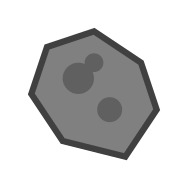
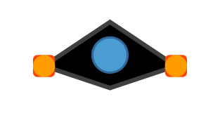

# Space Dodge Game 🚀

A Python-based arcade-style space game where players navigate through a field of asteroids, testing their reflexes and survival skills.

![Space Dodge Game]


![asteroid image]


![game icon]


![Space Background]


![Spaceship ]


## 🎮 Features

- Real-time space navigation with smooth controls
- Dynamic obstacle system with increasing difficulty
- Time-based scoring system
- Collision detection
- Custom space-themed graphics
- Progressive difficulty scaling

## 🛠️ Prerequisites

Before running the game, make sure you have the following installed:
- Python 3.x
- Pygame library

## ⚙️ Installation

1. Clone the repository:
```bash
git clone https://github.com/yourusername/space-dodge.git
cd space-dodge
```

2. Install required dependencies:
```bash
pip install pygame
```

3. Run the game:
```bash
python main.py
```

## 🎯 How to Play

- Use arrow keys or WASD to control your spaceship:
  - ⬆️ (W) - Move Up
  - ⬇️ (S) - Move Down
  - ⬅️ (A) - Move Left
  - ➡️ (D) - Move Right
- Dodge incoming asteroids
- Survive as long as possible
- Your time is your score!

## 🔧 Game Controls

| Key           | Action        |
|---------------|---------------|
| Arrow Up/W    | Move Up       |
| Arrow Down/S  | Move Down     |
| Arrow Left/A  | Move Left     |
| Arrow Right/D | Move Right    |
| ESC          | Exit Game     |

## 📁 Project Structure

```
space-dodge/
│
├── main.py           # Main game file
├── assets/          # Game assets directory
│   ├── images/      # Image assets
│   │   ├── space.jpg
│   │   ├── spaceship.jpg
│   │   └── asteroid.jpg
│   └── fonts/       # Font assets
├── README.md        # This file
└── requirements.txt # Project dependencies
```

## 🚀 Technical Implementation

The game is built using Python and Pygame, featuring:
- Object-oriented design for game entities
- Efficient collision detection system
- Dynamic difficulty scaling
- State management for game progression
- Event-driven architecture for user inputs
- Custom settings management

## 🎨 Assets Used

- Background space image
- Spaceship sprite
- Asteroid obstacles
- System fonts

## 🤝 Contributing

Contributions are welcome! Please feel free to submit a Pull Request.

## 📝 License

This project is licensed under the MIT License - see the LICENSE file for details.

## 👥 Acknowledgments

- Thanks to Pygame community for the excellent documentation

## 📞 Contact

- Your Name:SUBHANSH TYAGI
- LinkedIn: linkedin.com/in/subhansh-tyagi-2593b8321
- GitHub: Coder-Subhansh
